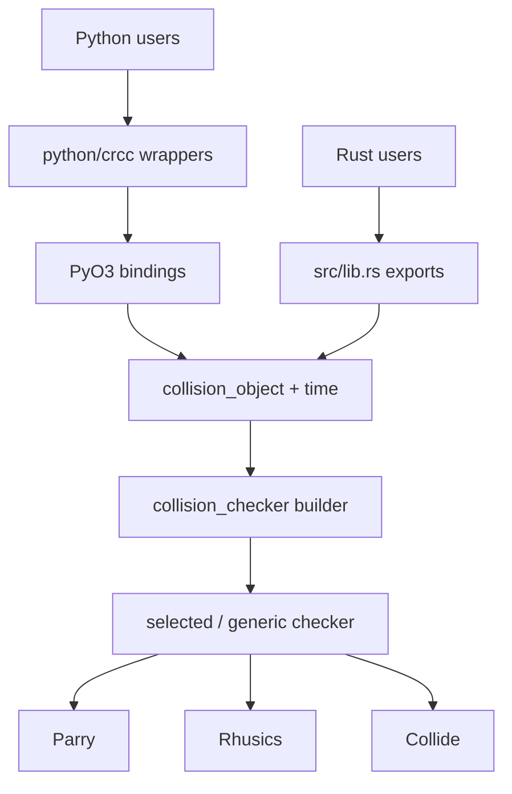

# Architecture

CRCC keeps one backend-independent geometry model and converts it at the query boundary into Parry, Rhusics, or Collide representations. The same core powers the Rust API, the PyO3 extension, the CommonRoad adapter, and repository tools.

## Layer Map

## Domain Geometry

`src/collision_object/` owns backend-independent geometry:

- `mod.rs`: compounds, validated constructors, pair-query entry points, and swept-area composition.
- `simple.rs`: primitive/wrapper types, polygon classification, validation, and conservative sweeps.
- `dynamic.rs`: fixed- and varying-shape trajectories.
- `distance.rs`: shared geometric distance used by runtime Rhusics and Collide queries.

`CollisionObject` is a union of simple objects. Complex polygons are classified at construction and decomposed during backend conversion. This delays backend-specific representation choices until an engine is selected.

## Time

`src/time/mod.rs` defines `TimeStep(i32)` and `TimeStepSet`, an ordered `BTreeSet`. Named predecessor, successor, and step-addition helpers provide saturating or checked behavior around integer limits.

Ordered sets are why scene queries can report the earliest dynamic result without separately sorting every query.

## Collision Engines

`src/collision_checker/engine/mod.rs` defines `EngineCollisionObject`, the trait implemented by backend representations. It covers:

- Discrete collision at two poses.
- Continuous collision between two pose pairs.
- Optional backend distance.

The engine modules translate domain geometry and implement backend behavior:

- `engine/parry/`: Parry shapes, native distance, and nonlinear casts.
- `engine/rhusics/`: GJK finite geometry, analytic half-spaces, and native translational TOI.
- `engine/collide/`: convex support data, bounding spheres, analytic circle cases, and conservative recursive CCD.

Runtime pair functions convert both operands for every call. Generic Rust users can convert once and use `CollisionChecker<E>` directly.

## Scene Construction

`CollisionCheckerBuilder` accumulates domain objects. Building a checker:

1. Merges all static geometry.
2. Converts static and dynamic objects to the selected backend.
3. Collects the union of dynamic active time steps.
4. Produces an immutable checker.

The Python builder wrapper is mutable and fluent, but `build()` returns an immutable native checker. Building clones core builder state, allowing reuse of the Python builder.

## Scene Queries

There are two Rust checker forms:

- `CollisionChecker<E>` uses compile-time backend dispatch.
- `SelectedCollisionChecker` stores one typed checker behind a runtime engine enum.

The Python API exposes the runtime-selected form.

Static query flow:

1. Check merged static scene geometry.
2. Iterate selected scene dynamic time steps in ascending order.
3. Check discrete occupancy and eligible adjacent intervals.
4. Return the first status.

Dynamic query flow:

1. Iterate selected query trajectory time steps.
2. Check the query against merged static geometry.
3. Check against scene dynamic objects at matching samples/intervals.
4. Return the first attributed time.

## Continuous-Collision Bounds

Dynamic obstacles precompute a conservative object for each adjacent pose pair. Translation-only finite geometry can use endpoint hulls; rotation uses radial bounds; rotating half-spaces become full-space bounds. Backends then apply their own broad and narrow phases.

This two-stage design explains the asymmetric continuous-query contract: broad bounds can preserve safety by producing a positive when a narrow exact answer is unavailable.

## Prepared and Batch Queries

Prepared queries own engine-converted query geometry and retain the selected engine for compatibility checks. They reduce conversion cost for reuse.

Rayon-backed batch methods preserve input order. Runtime dispatch selects sequential execution below 32 items and the Rayon pool at or above 32. Python releases the GIL while native batch work executes.

## Python Boundary

`src/python/` contains PyO3 classes and converts `CrccError` to Python `ValueError`.

`python/crcc/` contains small Python-facing wrappers:

- Root re-exports define the supported top-level API.
- `collision_checker.py` wraps the native builder with a stable fluent interface.
- `commonroad.py` converts scenarios, shapes, occupancies, and predictions.
- `.pyi` files are the authoritative Python signatures used by Pyright and editors.

The extension module is `crcc._core`; application code should import from `crcc` or `crcc.commonroad`, not from `_core`.

## CommonRoad Conversion

The adapter translates CommonRoad geometry into CRCC domain objects before building a checker. Trajectory predictions preserve listed poses and use empty geometry for missing intermediate states, preventing phantom motion across gaps. Occupancy groups and multipolygons become compounds.

The Rust crate does not parse CommonRoad XML. Scenario loading and CommonRoad model conversion are Python-layer capabilities.

## Repository Tools

- `main.py`: repository-only dispatcher for tutorials, playground, and benchmark actions.
- `examples/`: deterministic basic, continuous, and CommonRoad demonstrations.
- `tools/playground.py`: interactive Matplotlib visualizer.
- `tools/benchmark/`: research benchmark orchestration, artifacts, reports, and plots.
- `src/bin/`: native/public-layer and Rayon benchmark binaries.

These tools exercise public behavior but are not part of the installed Python command surface.

## Feature Boundaries

Cargo features keep backend dependencies optional. Default features enable all three engines. `rayon` enables Rust batches; `python_bindings` enables PyO3 and Rayon; `benchmarking` exposes benchmark-only support.

A no-default-feature build retains geometry and types but has no usable collision engine. Python bindings require at least one engine at compile time.

## Design Constraints

- Geometry is immutable after construction.
- Scenes are immutable after build.
- Compound union is structural, not a Boolean geometry operation.
- Continuous positives can be conservative.
- Prepared queries cannot cross engines.
- Backend contact semantics are not forced into artificial equality.

These constraints keep the public model small and let each backend retain its actual algorithmic behavior.
