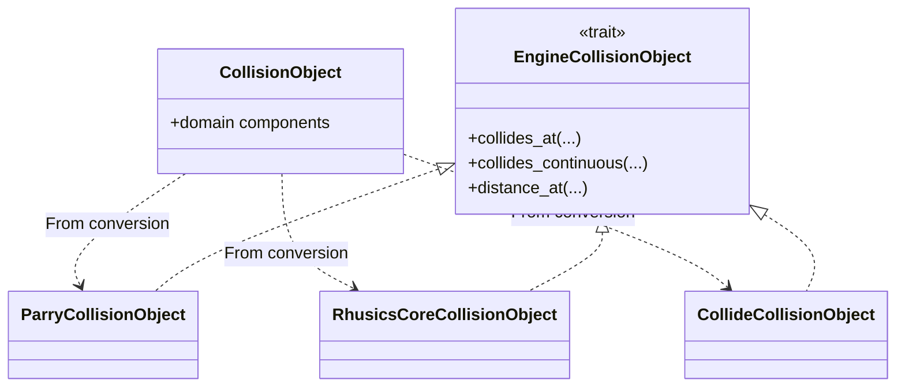

# Backend and binding boundaries

## Backend abstraction

`src/collision_checker/engine/mod.rs` defines `EngineCollisionObject`, the backend representation contract. It requires conversion from `CollisionObject` and discrete and continuous queries; `distance_at` has an unsupported default. The runtime `CollisionEngine` dispatcher converts pair-query operands and calls the selected implementation. Cargo features omit optional backends from the build.

The runtime-selected checker uses an enum of compiled concrete checker types. The generic `CollisionChecker<E>` instead carries one backend representation type through Rust calls. This keeps the regular domain API independent of engine-specific shapes while allowing typed dispatch where useful.

## Backend modules

- `engine/parry/` converts to Parry shapes, uses native distance, and uses nonlinear shape casts with CRCC special cases.
- `engine/rhusics/` converts finite convex components for GJK and keeps half-spaces in an analytic representation. Translational finite-shape CCD can use time of impact; rotation and half-space motion use conservative handling.
- `engine/collide/` converts finite shapes to Collide convex/support representations, adapts finite component sets for a local broad phase, checks candidates with collision tests, and handles half-spaces analytically. Continuous queries include circle special cases and conservative recursive interval subdivision.

Distance for runtime Rhusics and Collide pair queries uses CRCC's shared geometric fallback. Backend behavior and contact differences are summarized in [Backends](../concepts/backends.md).

This fallback bypasses the trait's typed `distance_at`: Rhusics/Collide representations retain its unsupported default. `From<CollisionObject>` cannot return errors; Parry can store an invalid representation until query time. The adapter boundary must therefore define both conversion and error-reporting semantics.

## Python boundary

`src/python/` contains PyO3 classes for the public native types. `CrccError` maps to Python `ValueError`. The extension module is `crcc._core`; application code should import public names from `crcc`, not `_core`.

`python/crcc/` keeps lightweight wrappers for geometry, poses, dynamic obstacles, and checker construction. `__init__.py` defines root re-exports; `.pyi` files define editor and Pyright signatures. `commonroad.py` is a Python-only adapter: it converts CommonRoad shapes, occupancies, predictions, and lanelet boundaries to domain types before calling the core builder.

The native builder exposes `engine`/`with_*`; the public facade exposes `backend`/`add_*` and compatibility warnings. Python's `CollisionBackend` is Rust's `CollisionEngine` under a PyO3 name override. Python statuses are converted from Rust statuses; signed `TimeStep` becomes an integer. Native batch results are collected into a single Python result, so any error raises instead of returning Rust's per-entry errors.

CommonRoad XML loading stays outside the Rust crate. The Python adapter preserves listed trajectory times and represents missing occupancies as empty geometry. See the [CommonRoad guide](../guides/commonroad.md).
