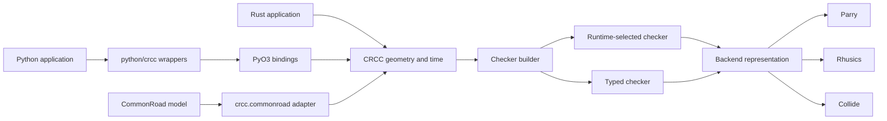

# Architecture overview

CRCC separates backend-independent geometry from engine-specific representations. Rust owns the geometry model, time model, checker pipeline, and backend adapters. PyO3 exposes the core; small Python modules provide the public package shape and CommonRoad conversion.

## Repository boundaries

| Path | Responsibility |
| --- | --- |
| `src/collision_object/` | Domain shapes, compounds, validation, trajectories, and swept bounds. |
| `src/collision_checker/` | Builder, checker queries, selected/generic checker forms, backend trait, and adapters. |
| `src/time/` | `TimeStep`, checked/saturating helpers, ranges, and ordered active-time sets. |
| `src/python/` | PyO3 wrappers and conversion between Python values and Rust core types. |
| `python/crcc/` | Public Python re-exports, fluent builder wrapper, type stubs, and CommonRoad adapters. |
| `examples/`, `main.py`, `tools/` | Repository tutorials, playground, and benchmarks; not installed as a `crcc` command. |

## Main design constraints

- Domain geometry is converted at a backend boundary rather than exposing three shape models to users.
- Scene construction converts and prepares objects once; built checkers are immutable.
- `CollisionChecker<E>` supports Rust static dispatch; `SelectedCollisionChecker` stores a runtime choice and is used by Python.
- Prepared queries retain converted geometry and are backend-specific.
- Continuous queries are conservative; a positive can mean possible collision.
- Backend-specific contact semantics remain visible instead of being normalized to a false parity guarantee.

Continue with the [query pipeline](query-pipeline.md) or [backend and binding boundaries](backends-and-bindings.md).
