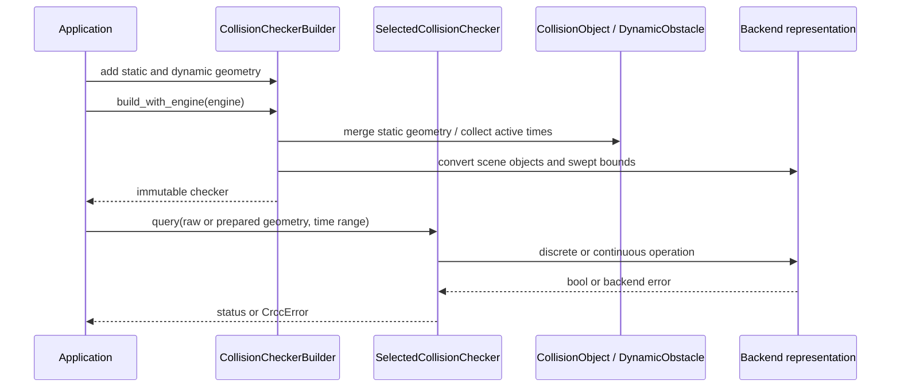

# Query pipeline

The core query path begins with domain geometry, normally obtained from validated constructors. Lower-level Rust entry points can bypass validation. Pair collision APIs convert operands at the call boundary; runtime Rhusics/Collide distance uses shared domain calculations instead. Scene checkers convert scene geometry during construction; prepared queries convert reusable query geometry once.

## Scene construction

The builder stores domain `CollisionObject` and `DynamicObstacle` values. Trajectory constructors already computed interval bounds. Building merges static scene components, converts geometry and cached bounds, and collects active times. Static geometry and dynamic obstacle state are then owned by an immutable checker. Conversion can retain a deferred error representation; construction alone does not prove query support.

## Static scene query

1. Check the query against merged static geometry.
2. Iterate selected active dynamic times in ascending order.
3. Check any adjacent interval whose endpoints are both selected, then discrete occupancy at its start.
4. Return the first collision status or propagate a query error.

Static scene hits take precedence over dynamic scene checks, and static geometry is not filtered by the requested dynamic time range.

## Dynamic query

1. Clip the range to the query trajectory's active span and visit selected starts in ascending order.
2. If the query has a next sample, check the outgoing interval, even when its endpoint exceeds the range.
3. Check interval against static scene geometry first, then scene trajectories; if clear, check sampled occupancy in the same order.
4. Return the first `CollidesDynamic(start)` or propagate an error. No active query times means no scene checks.

Continuous handling first uses conservative bounds where available, then dispatches backend-specific narrow queries. A broad-phase overlap is not itself an exact collision result; unresolved conservative cases can produce a positive. See [continuous collision](../concepts/continuous-collision.md).

## Prepared and batch execution

Prepared objects contain backend-converted geometry and cannot be reused with another backend. Python batch queries release the GIL during native execution. Rust batch APIs require the caller to select sequential or Rayon execution; they preserve input order and retain a per-query result/error.

They are reusable with another **same-backend** scene. Heterogeneous Rust batches perform backend-mismatch preflight for the whole batch. Python collapses native results to a complete list or one exception. See [batch contracts](../guides/prepared-and-batch-queries.md).

## Broad versus narrow phase

Dynamic CCD candidate filtering collision-tests conservative swept bounds; this is not an independent universal AABB scene tree. Fixed-shape narrow queries use endpoint motion. Time-varying narrow queries use the world-space swept union itself, with identity poses. Native compound/set acceleration belongs to each backend; [backend details](../concepts/backends.md) describe what follows candidate filtering.
