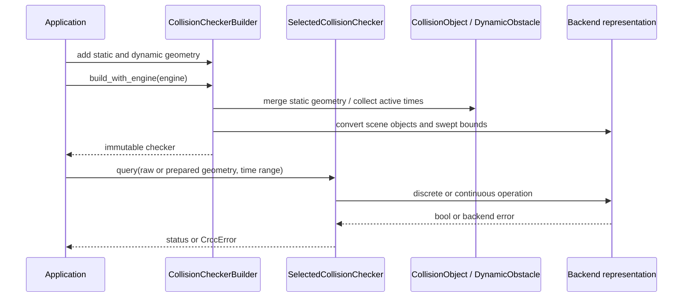

# Query pipeline

The core query path begins with validated CRCC geometry. Pair APIs convert operands for the requested backend at the call boundary. Scene checkers convert scene geometry during construction; prepared queries convert reusable query geometry once.

## Scene construction

The builder stores domain `CollisionObject` and `DynamicObstacle` values. Building merges static scene components, converts static and dynamic geometry to backend representations, constructs conservative bounds for adjacent trajectory samples, and collects active times. Static geometry and dynamic obstacle state are then owned by an immutable checker.

## Static scene query

1. Check the query against merged static geometry.
2. Iterate selected active dynamic times in ascending order.
3. Check discrete occupancy and any adjacent interval whose endpoints are both selected.
4. Return the first collision status or propagate a query error.

Static scene hits take precedence over dynamic scene checks, and static geometry is not filtered by the requested dynamic time range.

## Dynamic query

1. Iterate the selected query trajectory samples and intervals.
2. Check each sample/interval against static scene geometry.
3. Check against scene dynamic obstacles at matching times and intervals.
4. Return the first attributed dynamic status or propagate an error.

Continuous handling first uses conservative bounds where available, then dispatches backend-specific narrow queries. A broad-phase overlap is not itself an exact collision result; unresolved conservative cases can produce a positive. See [continuous collision](../concepts/continuous-collision.md).

## Prepared and batch execution

Prepared objects contain backend-converted geometry and cannot be reused with another backend. Python batch queries release the GIL during native execution. Rust batch APIs require the caller to select sequential or Rayon execution; they preserve input order and retain a per-query result/error.
