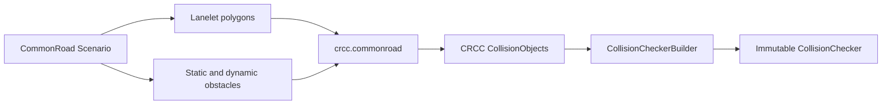

# CommonRoad integration

CommonRoad conversion is provided by the Python module `crcc.commonroad`; the Rust crate does not parse CommonRoad XML or depend on CommonRoad model types. The adapter converts scenario geometry into CRCC objects and populates a regular `CollisionCheckerBuilder`.

## Convert a scenario

From the repository checkout, load a tracked scenario and build a checker:

```python
from commonroad.common.file_reader import CommonRoadFileReader
from crcc import CollisionBackend, CollisionCheckerBuilder
from crcc.commonroad import scenario_builder

scenario, _ = CommonRoadFileReader(
    "scenarios/DEU_MerzenichRather-2_870_T-149.xml"
).open()

builder = scenario_builder(
    scenario,
    builder=CollisionCheckerBuilder(backend=CollisionBackend.Parry),
)
checker = builder.build()
```

The file is tracked with Git LFS; run `git lfs pull` after cloning. `scenario_builder` adds a road boundary when lanelets exist, then converts static and dynamic obstacles. An empty lanelet network adds no boundary constraint.

## Conversion flow



## Shapes and occupancies

`from_shape` converts supported circles, rectangles, and polygons. Other shape implementations are converted through their occupancy at the origin. `from_occupancy` handles circle, rectangle, and polygon occupancies directly; occupancy groups and Shapely multipolygons become compounds. Empty Shapely geometry becomes empty CRCC geometry; unsupported non-empty Shapely types raise `ValueError`.

`from_polygon` preserves exterior and interior rings. CRCC then validates and decomposes complex polygons during backend conversion.

## Dynamic predictions

`from_dynamic_obstacle` supports trajectory predictions and set-based occupancy predictions. Listed trajectory states retain their time steps. Missing intermediate states become empty geometry, suppressing motion across the gap. The adapter requires exact integer CommonRoad time steps; unsupported values raise `ValueError` instead of being rounded.

## Road boundaries

The adapter builds occupied geometry outside the union of lanelet polygons. The Rust geometry routine unions and simplifies the drivable polygons, represents the outside of their convex hull using half-spaces, and adds significant holes within the hull. Small holes at or below `0.001 m²` are ignored. If a boundary component cannot be represented, the implementation conservatively returns full-space geometry.

An absent lanelet network is different from an empty direct boundary input: `scenario_builder` skips adding a boundary when there are no lanelets, while the low-level `road_boundary` helper returns full-space geometry for empty input. See [errors and limits](../reference/errors-and-limits.md) and the [CommonRoad API](../reference/python.md#commonroad-module).
