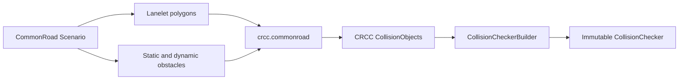

# CommonRoad integration

CommonRoad conversion is provided by the Python module `crcc.commonroad`; the Rust crate does not parse CommonRoad XML or depend on CommonRoad model types. The adapter converts scenario geometry into CRCC objects and populates a regular `CollisionCheckerBuilder`.

## Convert a scenario

From the repository checkout, load a tracked scenario and build a checker:

```python
from commonroad.common.file_reader import CommonRoadFileReader
from crcc import Circle, CollisionBackend, CollisionCheckerBuilder
from crcc.commonroad import scenario_builder

scenario, _ = CommonRoadFileReader(
    "scenarios/ZAM_Tutorial-1_2_T-1.xml"
).open()

builder = scenario_builder(
    scenario,
    builder=CollisionCheckerBuilder(backend=CollisionBackend.Parry),
)
checker = builder.build()
assert checker.backend == CollisionBackend.Parry
status = checker.collides_static(Circle(0.25))
assert isinstance(status.collides, bool)
```

The file is tracked with Git LFS; run `git lfs pull` after cloning. `scenario_builder` adds a road boundary when lanelets exist, then converts static and dynamic obstacles. An empty lanelet network adds no boundary constraint.

## Conversion flow



## Shapes and occupancies

`from_shape` accepts CommonRoad's current `CircleObstacleShape`, `RectObstacleShape`, and `PolygonObstacleShape`. Other shape implementations are converted through their occupancy at the origin. A shifted rectangle uses local center `(-origin_x_shift, 0)`. `from_occupancy` handles circle, rectangle, and polygon occupancies directly. Other occupancies, including groups, go through `.shapely_object`: a resulting Polygon becomes a polygon, MultiPolygon a compound, and empty geometry an empty compound. Groups do not preserve native child types; a grouped circle can become polygonal.

`from_shape` returns **local** geometry; apply the state pose separately. `from_occupancy` returns **world-positioned** geometry; use identity pose to avoid applying the transform twice. Nonempty Shapely points, lines, and geometry collections are unsupported.

`from_polygon` transfers exterior and interior rings to CRCC's constructor, which sanitizes and validates them. Complex polygon decomposition happens on backend conversion. Unlike `from_shapely`, direct `from_polygon` does not special-case empty polygons.

```python
from commonroad.geometry.obstacle_shapes.circle_obstacle_shape import CircleObstacleShape
from crcc import Circle, Pose
from crcc.commonroad import from_shape

shape = from_shape(CircleObstacleShape(radius=1.0))
assert Circle(0.25).collides(shape, pos_other=Pose.from_translation((1.0, 0.0)))
```

## Dynamic predictions

`from_dynamic_obstacle` supports trajectory predictions and set-based occupancy predictions:

- Trajectory predictions enumerate integer steps from the obstacle's initial time through the prediction's final time. The initial sample uses the obstacle shape/state; later listed states use the prediction shape. Missing states become empty geometry with identity pose. Duplicate state times overwrite earlier entries in the lookup.
- Other predictions sample `occupancy_at_time` over the same inclusive span. Missing occupancy is empty; supplied world-space occupancy uses identity poses. Interval-valued final times use their `.end`.
- With no prediction, only initial occupancy is represented; there is no stationary continuation.

Both routes create **time-varying** CRCC geometry, not a fixed-shape rigid-motion trajectory. Continuous checks use the swept-union model described in [CCD](../concepts/continuous-collision.md#dynamic-trajectories).

State conversion requires `position` to be a NumPy array of shape `(2,)` and `orientation` to be a real scalar. No orientation is inferred from velocity. Time validation uses Python `int`, does not round floats, and rejects NumPy integer scalars; core times must fit signed 32-bit values. The non-trajectory route rejects final time before initial time; the trajectory route can produce an empty trajectory for that case.

`scenario_builder` adds lanelets, static obstacles (their initial occupancy becomes timeless geometry), then dynamic obstacles. It does not convert planning problems, phantom/environment collections, signals, or obstacle IDs. `scenario.dt` is not stored by CRCC: query time values are sample indices. Conversion mutates a supplied builder incrementally; a later failure does not roll back earlier additions.

## Road boundaries

The Rust routine unions lanelet polygons, simplifies at `0.01` coordinate units, represents the outside of their convex hull using half-spaces, and adds complement regions within the hull with area greater than `0.001` squared units. These correspond to meters/meters squared only when coordinates use meters. Simplification and omission of small regions make this an approximation, not an exact complement. If a constructed component cannot be represented, it returns full space; input lanelets are not validated before Boolean operations.

The Python `ROAD_BOUNDARY_*` constants mirror these values but do not configure the Rust routine.

An absent lanelet network is different from an empty direct boundary input: `scenario_builder` skips adding a boundary when there are no lanelets, while the low-level `road_boundary` helper returns full-space geometry for empty input. See [errors and limits](../reference/errors-and-limits.md) and the [CommonRoad API](../reference/python.md#commonroad-module).

There are two `road_boundary` functions: `crcc.road_boundary(exterior_rings)` accepts coordinate sequences; `crcc.commonroad.road_boundary(lanelet_network)` accepts a CommonRoad network. Import explicitly to avoid mixing their contracts.
